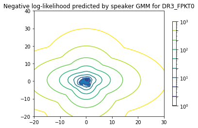
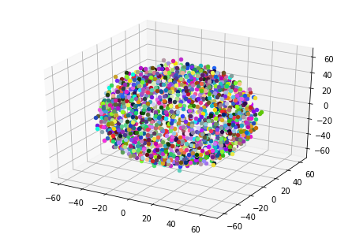
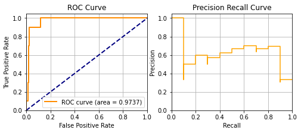

<p align="center">
  <a href="#"></a>
</p>
<p align="center">
    <em>Speaker verification using Gaussian Mixture Model (GMM).</em>
</p>
<p align="center">
<a href="https://www.python.org/downloads/release/python-380/" style="text-decoration: none;" target="_blank">
    
</a>

<a href="https://colab.research.google.com/github/zabir-nabil/speaker-verification-gmm/blob/main/speaker_veri_gmm_ubm.ipynb" style="text-decoration: none;">
  
</a>

</p>

---
### Run

1. Run in google colab

### Plots

<p align="center">
  
</p>

<p align="center">
  <a href="#"></a>
</p>

### Results

```
accuracy score for DR3_FPKT0: 100.0%
eer score for DR3_FPKT0: 11.377245508993903% with threshold -7.957904145487239
              precision    recall  f1-score   support

           0       1.00      1.00      1.00       167
           1       1.00      1.00      1.00        10

    accuracy                           1.00       177
   macro avg       1.00      1.00      1.00       177
weighted avg       1.00      1.00      1.00       177


accuracy score for DR3_MJJG0: 98.87005649717514%
eer score for DR3_MJJG0: 13.7724550898456% with threshold -7.269569053999492
              precision    recall  f1-score   support

           0       0.99      0.99      0.99       167
           1       0.90      0.90      0.90        10

    accuracy                           0.99       177
   macro avg       0.95      0.95      0.95       177
weighted avg       0.99      0.99      0.99       177


accuracy score for DR3_FCMH0: 99.43502824858757%
eer score for DR3_FCMH0: 1.1976047904198035% with threshold -6.315210336766802
              precision    recall  f1-score   support

           0       0.99      1.00      1.00       167
           1       1.00      0.90      0.95        10

    accuracy                           0.99       177
   macro avg       1.00      0.95      0.97       177
weighted avg       0.99      0.99      0.99       177


accuracy score for DR3_MWJG0: 99.43502824858757%
eer score for DR3_MWJG0: 10.000000000018641% with threshold -7.284514182552126
              precision    recall  f1-score   support

           0       0.99      1.00      1.00       167
           1       1.00      0.90      0.95        10

    accuracy                           0.99       177
   macro avg       1.00      0.95      0.97       177
weighted avg       0.99      0.99      0.99       177


accuracy score for DR3_MTAA0: 99.43502824858757%
eer score for DR3_MTAA0: 4.790419161838868% with threshold -6.471338153605574
              precision    recall  f1-score   support

           0       0.99      1.00      1.00       167
           1       1.00      0.90      0.95        10

    accuracy                           0.99       177
   macro avg       1.00      0.95      0.97       177
weighted avg       0.99      0.99      0.99       177


------------------------------------------------------------------------------------
------------------------------------------------------------------------------------
------------------------------------------------------------------------------------
Final average test accuracy: 2.959375840731773%
Final average test EER: 0.244867408042362%
Final accuracy score for all speakers: 99.43502824858757%
Final eer score for all speakers: 9.131652661064422%
              precision    recall  f1-score   support

           0       1.00      1.00      1.00       835
           1       0.98      0.92      0.95        50

    accuracy                           0.99       885
   macro avg       0.99      0.96      0.97       885
weighted avg       0.99      0.99      0.99       885
```

> ...


### Support

> **Tested with:** `python3.6` `python3.7` `python3.8`

> **TO-DO:**
 - [ ] gmm-ubm
 - [ ] svm
 - [ ] inference script

